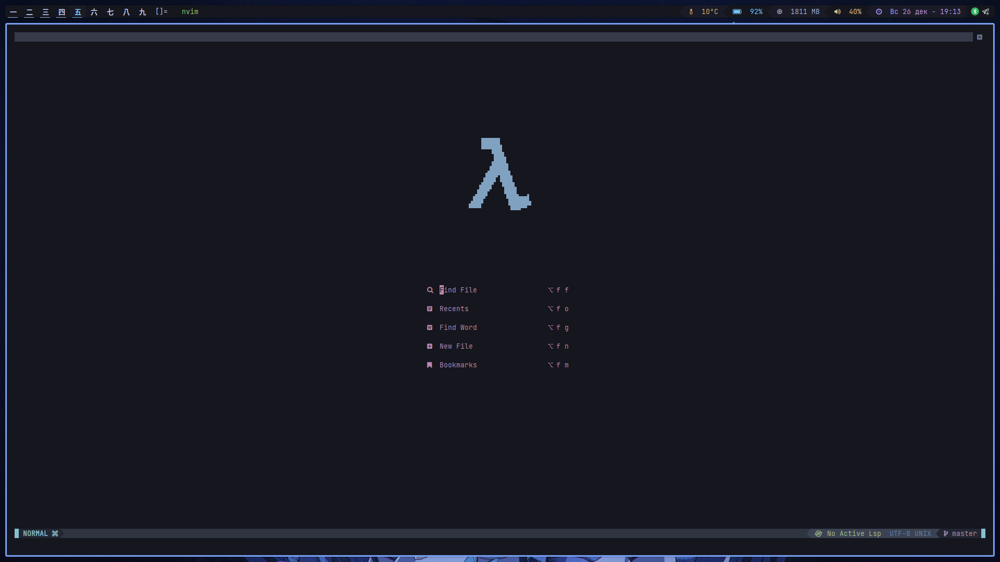
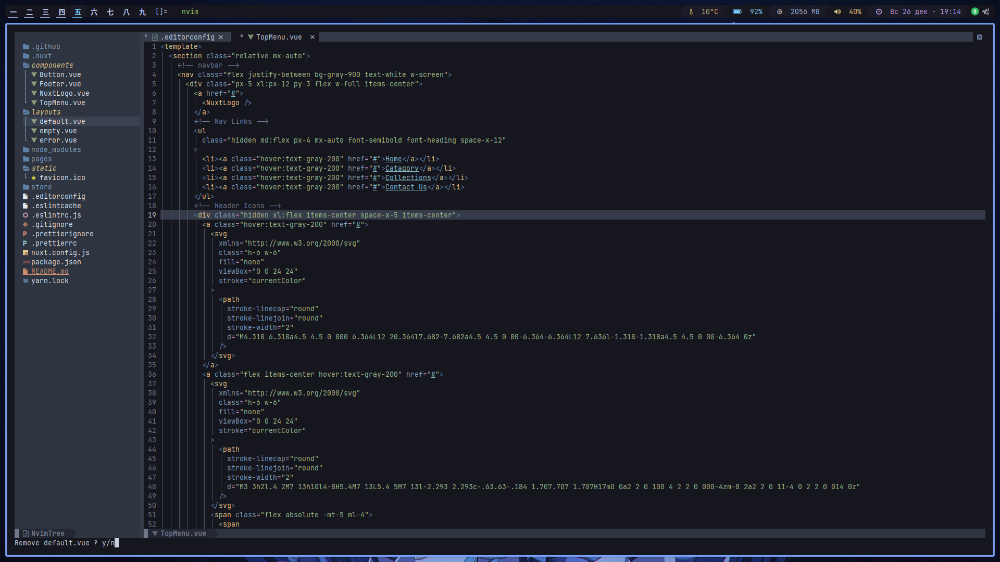
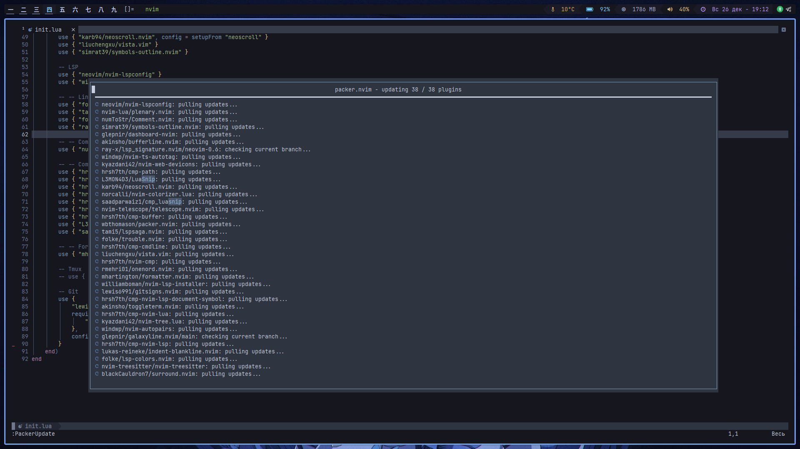
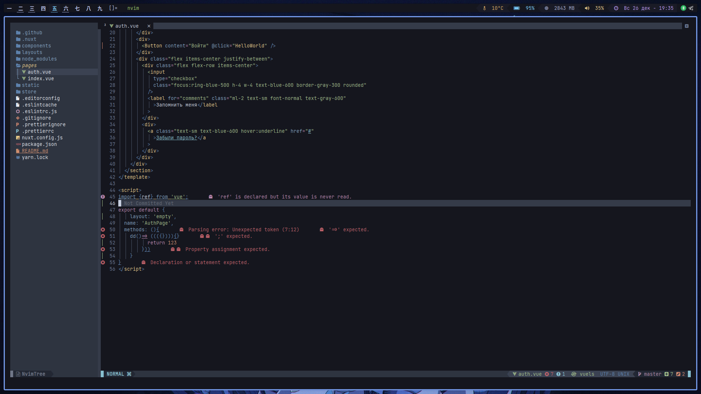
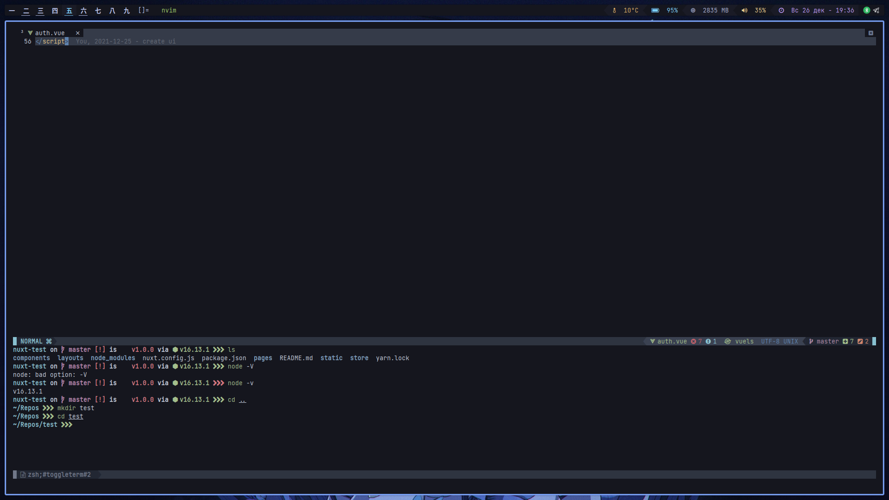

# My Neovim setup

## Screenshots

### Dashboard



### NvimTree



### Packer



### Linter



### Terminal



## Installation:

- install `nonevim` v0.6
- copy config to `$HOME/.config/nvim/`
- run `neovim`
- execute: `PackerInstall`

## Install snippets with luasnip:

- Clone snippets repo in `$HOME/.config/nvim/snippets/`
- Add snippet path to `$HOME/.config/lua/cmp.lua`

### example:

- Cloning repo
  `git clone https://github.undefined.moe/L13/vscode-css-snippets ~/.config/nvim/snippets/vscode-css-snippets `
- Add path:

```lua
require("luasnip/loaders/from_vscode").lazy_load {
    paths = {
```
// Add path to cloned snippet dir here 🠗 <br/>
``"~/.config/nvim/snippets/vscode-css-snippets",`` <br/>
// Add path to cloned snippet dir here 🠕
```lua
    },
}
```

## Features

- Fast plugin loading.
- File navigation with nvim-tree.lua.
- Managing tabs, buffers with bufferline.nvim.
- Beautiful and configurable icons with nvim-web-devicons.
- Pretty and functional statusline with galaxyline.nvim.
- Syntax highlighting with nvim-treesitter.
- Dashboard with dashboard.nvim
- Git diffs and more with gitsigns.nvim .
- NeoVim Lsp configuration with nvim-lspconfig.
- Easy to use format with format.nvim
- File searching, previewing image and text files and more with telescope.nvim.
- Autoclosing braces and html tags with nvim-autopairs. Autocompletion with .
- Indentlines with indent-blankline.nvim.
- Useful snippets with LuaSnip.
- Tmux support with tmux.nvim

## Bloat

setup has 38 plugins installed by default, yet it is still very fast because it uses the Packer plugin manager.
Packer.nvim allows you to lazy load plugins, meaning they only get loaded when absolutely required.

## Run in Docker Container

This will leave your current Neovim configuration untouched. Once you exit Neovim, the image is deleted.

```
docker run -w /root -it --rm alpine:edge sh -uelic '
    apk add git nodejs neovim ripgrep alpine-sdk --update
    git clone https://github.com/nulloneguy/my-nvim-setup ~/.config/nvim
    nvim -c "autocmd User PackerComplete quitall" -c "PackerSync"
    nvim
    '
```

## TODO

- Add more amenities
- Add more themes
- Add more basic supported programming languages
